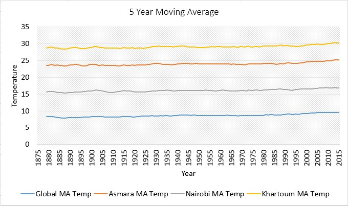
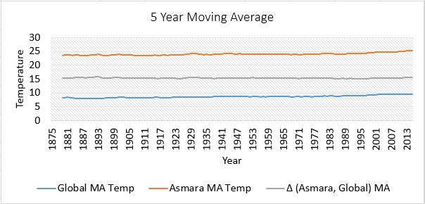
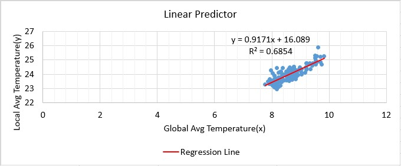
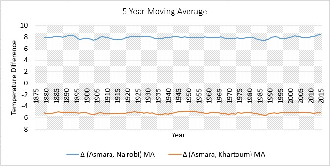
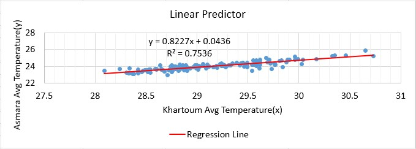

# Exploring Global and Local Temperature Trends

## Introduction
This project is aimed at analyzing local and global temperature data and comparing the trends in both temperatures. The global average temperature data contains 266 rows of records starting from 1750. The data contains 135 and 329 distinct countries and cities respectively. The questions raised for analyzing the data are:

* Is the local average temperature hotter or cooler to the global average? Has the difference been consistent over time?
* How do the changes in local temperatures over time when compared to the changes in the global average?
* What does the overall trend look like? Is the world getting hotter or cooler? Has the trend been consistent over the last few hundred years?

## Objective
Objective of this project is to compare local temperature data (for Asmara city in Eritrea) with the global temperature trend.

## Methodology
### Getting the Data
*	To search the nearest capital city from the country where I live in, I used the SQL query:    
```SELECT * FROM city_list ORDER BY city_list.country;```
*	To get the temperature data for Asmara city, I used the query:    
```SELECT * FROM city_data WHERE city_data.city = 'Asmara' AND city_data.country = 'Eritrea';```
*	Furthermore; the same query was used to extract temperature data for Nairobi and Khartoum. These are used for comparison purpose.
*	To get the global temperature data, I used the query:    
```SELECT * FROM global_data;```
*	All the return data were saved as a CSV file.
### Exploring the Data
*	_Excel_ was used to analyze and visualize the data.
*	The global temperature data starts at the year of 1750. Nairobi’s and Khartoum’s data start at the year of 1850 and 1859 respectively. However; Asmara’s (is the local) data starts at the year of 1864. Furthermore; there are lots of missing values in the data during 1864-1874. Hence; data starting from the year of 1875 was considered for all countries including the global temperature. Any _missing values after 1875 are replaced by the previous five years’ average temperature_. 
*	The _moving average temperature was calculated using the previous five years of data_.
*	Since type of the data is time series and numerical, it can be best visualized using _line chart_. However; to visualize the relationship between variables _scatterplot_ was used.

## Result and Discussion
The local and global temperature trend is depicted in the following figure.


    
**Figure 1**: Five year moving average of local and global temperature. 


*	As Figure 1 shows, _Asmara’s average temperature is hotter than the global average_. As shown in Figure 2, the difference between Asmara’s average temperature and the global average temperature is _consistently around 15<sup>o</sup>C_. The average temperature difference was 15.37<sup>o</sup>C.    


    
**Figure 2**: Five year moving average of temperature difference between local and global.


*	_Both the global and local average temperatures are slowly rising_. However; the average temperature change for Asmara is higher than the change in the global average, as σ<sub>Global</sub>=0.46<sup>o</sup>C and σ<sub>Asmara</sub>=0.51<sup>o</sup>C. Hence; _the average change in local temperature is higher than the global by 0.05<sup>o</sup>C_.

*	The average local and global temperature changes during 1976-2015(past 39 years) were higher than the changes in 1875-1975(past 100 years). σ<sub>Global(1875-1975)</sub>=0.28<sup>o</sup>C and σ<sub>Asmara(1875-1975)</sub>=0.36<sup>o</sup>C, however; σ<sub>Global(1976-2015)</sub>=0.36<sup>o</sup>C and σ<sub>Asmara(1976-2015)</sub>=0.49<sup>o</sup>C. Hence; _the temperature change in the past 39 years was higher than the past 100 years_.    

The relationship between local and global average temperature is depicted in the following figure.


    
**Figure 3**: Scatterplot showing the relationship between local and global temperature.


*	The _correlation coefficient_ r (between Asmara and global data) = 0.83. Hence; the correlation between global and local temperatures is _high and positive_. Based on the regression equation shown in Figure 3 and the global average temperature, local averages can be estimated.

*	When Asmara’s average temperature is compared to Nairobi, Asmara seem hotter by average of 7.9<sup>o</sup>C. However; Asmara is on average 5.1<sup>o</sup>C cooler than Khartoum. As shown in Figure 4, these temperature differences had been consistent for the past hundred years. (≈-5<sup>o</sup>C between Asmara and Khartoum) and (≈8<sup>o</sup>C between Asmara and Nairobi). 


    
**Figure 4**: Temperature difference between Asmara and other capitals.


*	The average change in temperature of Asmara and Khartoum is higher than the global average temperature change, as σ<sub>Global</sub>=0.46<sup>o</sup>C, σ<sub>Nairobi</sub>=0.43<sup>o</sup>C, σ<sub>Khartoum</sub>=0.54<sup>o</sup>C, and σ<sub>Asmara</sub>=0.51<sup>o</sup>C. However; Nairobi has the lowest average temperature change than Asmara and Khartoum.    
The relationship between local and Khartoum’s average temperature is depicted in the following figure.


    
**Figure 5**: Scatterplot showing the relationship between Asmara and Khartoum’s temperature.


*	The _correlation coefficient_ r (between Asmara and Khartoum) = 0.87. Hence; the temperature of Khartoum and Asmara are _highly, positively correlated_. (This is even greater than the correlation between Asmara’s and the global data) **Based on the regression equation shown in Figure 5 and the Khartoum’s average temperature, local average temperatures can be estimated better**. Perhaps, this could be due to the geographical closeness of the two cities.
